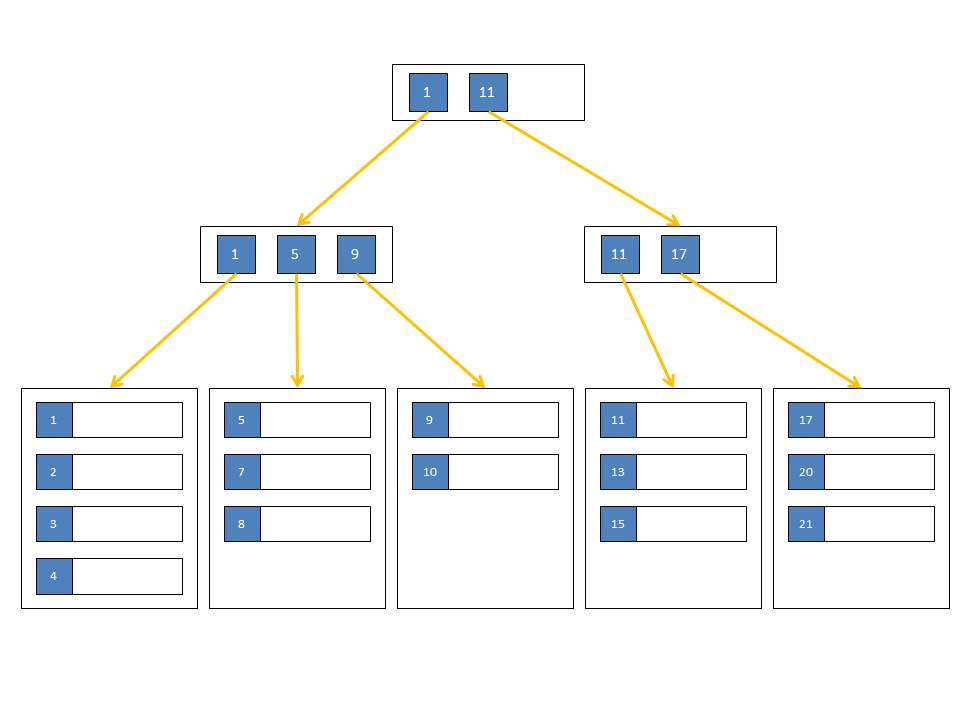

# Index types
https://www.youtube.com/watch?v=4Tgvd6NPufs&t=1258s

1. **BTree**
  
      
  
   **Example of table**
  
   ```sql
   CREATE TABLE people (
	last_name TEXT NOT NULL,
	first_name TEXT NOT NULL,
	dob TIMESTAMP NOT NULL,
	gender INT NOT NULL
    );
   ```
   **Index example**
   
   ```sql
   CREATE INDEX idx_people_name
    ON people USING btree
    (last_name, first_name, dob);
    ```
2. **Hash Indexes**  
**Example of table**
   ```sql
   CREATE TEMPORARY TABLE testhash (
	fname TEXT NOT NULL,
	lname TEXT NOT NULL
    );
    ```

 **Index example**
    
    ```sql
    CREATE INDEX idx_testhash_fname
    ON testhash USING hash (fname);
    ```

3. **GiST (R-Tree)**
4. **Inverted Index (GIN)**
5. **BIT index**
6. **Partial Index**
7. Functional Index
8. Clusterd index

# Join Stratagies (PostgreSQL)
http://datareview.info/article/8-sposobov-obedineniya-join-tablic-v-sql-chast-1/
1. Merge Join
2. https://ru.wikipedia.org/wiki/%D0%90%D0%BB%D0%B3%D0%BE%D1%80%D0%B8%D1%82%D0%BC_%D1%81%D0%BE%D0%B5%D0%B4%D0%B8%D0%BD%D0%B5%D0%BD%D0%B8%D1%8F_%D1%81%D0%BB%D0%B8%D1%8F%D0%BD%D0%B8%D0%B5%D0%BC_%D1%81%D0%BE%D1%80%D1%82%D0%B8%D1%80%D0%BE%D0%B2%D0%B0%D0%BD%D0%BD%D1%8B%D1%85_%D1%81%D0%BF%D0%B8%D1%81%D0%BA%D0%BE%D0%B2
3. Hash Join
4. https://ru.wikipedia.org/wiki/%D0%90%D0%BB%D0%B3%D0%BE%D1%80%D0%B8%D1%82%D0%BC_%D1%81%D0%BE%D0%B5%D0%B4%D0%B8%D0%BD%D0%B5%D0%BD%D0%B8%D1%8F_%D1%85%D1%8D%D1%88%D0%B8%D1%80%D0%BE%D0%B2%D0%B0%D0%BD%D0%B8%D0%B5%D0%BC
5. Nested Loop

