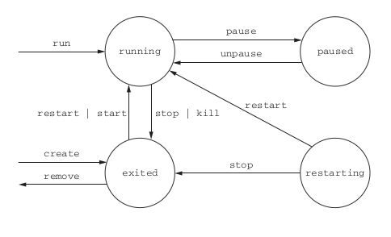

- [Basic Docker commands](#basic-docker-commands)
  * [How to list images](#how-to-list-images)
  * [How to list containers](#how-to-list-containers)
  * [How to run docker container](#how-to-run-docker-container)
  * [How to see what changes were done](#how-to-see-what-changes-were-done)
  * [How to do the commit](#how-to-do-the-commit)
  * [How to build image from Dockerfile](#how-to-build-image-from-dockerfile)
  * [List networks](#list-networks)
  * [Create a network](#create-a-network)
  * [Then we can add containers to that network as we run them](#then-we-can-add-containers-to-that-network-as-we-run-them)
  * [Inspect the network](#inspect-the-network)
  * [List volumes](#list-volumes)
  * [Create a volume named dbdata](#create-a-volume-named-dbdata)
  * [Inspect the volume](#inspect-the-volume)
  * [Then we can use this volume when we spin up a container, such as MySQL](#then-we-can-use-this-volume-when-we-spin-up-a-container-such-as-mysql)

# Basic Docker commands

## How to list images

```docker
docker image ls
```

## How to list containers

```docker
docker ps
```

## How to run docker container

Run command creates and starts new docker container

Run in interactive mode:

``` bash
docker run --rm -it \
    ubuntu:18.04 \
    bash
```

Run in detached mode:

```docker
docker run --rm -d \
    -v $(pwd):/application:/var/www/html \
    -p 8080:80 \
    shippingdocker/phpapp
```

## How to see list of changes that were done in container

```docker
docker diff <container-id-here>
```

## How to do the commit of the changes that were done. Commit creates a new image

```bash
docker commit -a "Chris Fidao" \
    -m "Nginx installed" \
    <container-id-here> \
    mynginx:latest
```

## Docker create command

Command "docker create" creates container and doesn't start it. Container is stopped.

```docker
docker create nginx
```

## Doker States

1. Running
2. PAUSED
3. EXITED
4. RESTARTING



## How to build image from Dockerfile

```bash
docker build -t shippingdocker/app:latest \
    -f docker/app/Dockerfile \
    docker/app
```

## Environment variable injection

```bash
    docker run --env MY_ENVIRONMENT_VAR="this is a test" \
    busybox:latest \
    env
```

## List networks

```bash
docker network ls
```

## Create a network

```bash
docker network create appnet
```

## Then we can add containers to that network as we run them

```bash
docker run --rm -d \
    --name=app \
    --network=appnet\
     shippingdocker/app:latest

docker run --rm -d \
    --name=mysql \
    --network=appnet \
    -e MYSQL_ROOT_PASSWORD=root \
    -e MYSQL_DATABASE=homestead \
    -e MYSQL_USER=homestead \
    -e MYSQL_USER_PASSWORD=secret \
    mysql:5.7
```

## Inspect the network

```docker
docker network inspect <network-name>
```

Result:

```json
[
    {
        "Name": "docker_appnet",
        "Id": "e0c5fe66e9f8a255c640c9768b040a6857757e7ef6be423725589c601da7c407",
        "Created": "2018-11-07T00:53:37.072438764+03:00",
        "Scope": "local",
        "Driver": "bridge",
        "EnableIPv6": false,
        "IPAM": {
            "Driver": "default",
            "Options": null,
            "Config": [
                {
                    "Subnet": "172.18.0.0/16",
                    "Gateway": "172.18.0.1"
                }
            ]
        },
        "Internal": false,
        "Attachable": true,
        "Ingress": false,
        "ConfigFrom": {
            "Network": ""
        },
        "ConfigOnly": false,
        "Containers": {
            "a40f9b9cb0e4d6bdeab20d07dcd63f3d239a53ed32da45a38659e32b44af8f89": {
                "Name": "docker_cache_1",
                "EndpointID": "101828fc7601bbe9d5555742e3d242ca7a278aad0b48e0eb2529ad67f68cbce3",
                "MacAddress": "02:42:ac:12:00:02",
                "IPv4Address": "172.18.0.2/16",
                "IPv6Address": ""
            },
            "fb7a601658ee3494aa432e5c69918a71264f9e5653e032c72368d844b29bcbad": {
                "Name": "docker_db_1",
                "EndpointID": "30075c1a8c2270cd1872f23953004a97db7f78753a8489e57b400d9ce56f4d28",
                "MacAddress": "02:42:ac:12:00:03",
                "IPv4Address": "172.18.0.3/16",
                "IPv6Address": ""
            }
        },
        "Options": {},
        "Labels": {
            "com.docker.compose.network": "appnet",
            "com.docker.compose.project": "docker"
        }
    }
]
```

## List volumes

```docker
docker volume ls
```

## Create a volume named dbdata

```docker
docker volume create dbdata
```

## Inspect the volume

```docker
docker volume inspect <volume-name>
```

Result:

```json
[
    {
        "CreatedAt": "2018-11-07T00:53:37+03:00",
        "Driver": "local",
        "Labels": {
            "com.docker.compose.project": "docker",
            "com.docker.compose.volume": "dbdata"
        },
        "Mountpoint": "/var/lib/docker/volumes/docker_dbdata/_data",
        "Name": "docker_dbdata",
        "Options": {},
        "Scope": "local"
    }
]
```

## Then we can use this volume when we spin up a container, such as MySQL

```docker
docker run --rm -d \
    --name=mysql \
    --network=appnet \
    -v dbdata:/var/lib/mysql \
    -e MYSQL_ROOT_PASSWORD=root \
    -e MYSQL_DATABASE=homestead \
    -e MYSQL_USER=homestead \
    -e MYSQL_USER_PASSWORD=secret \
    mysql:5.7
```

## Summary

1. Containers can be run with virtual terminals attached to the user’s shell or in detached mode.
2. By default, every Docker container has its own PID namespace, isolating process information for each container.
3. Docker identifies every container by its generated container ID , abbreviated container ID , or its human-friendly name.
4. All containers are in any one of four distinct states: running, paused, restarting, or exited.
5. The docker exec command can be used to run additional processes inside a running container.
6. A user can pass input or provide additional configuration to a process in a container by specifying environment variables at container-creation time.
7. Using the --read-only flag at container-creation time will mount the container file system as read-only and prevent specialization of the container.
8. A container restart policy, set with the --restart flag at container-creation time, will help your systems automatically recover in the event of a failure.
9. Docker makes cleaning up containers with the docker rm command as simple as creating them.